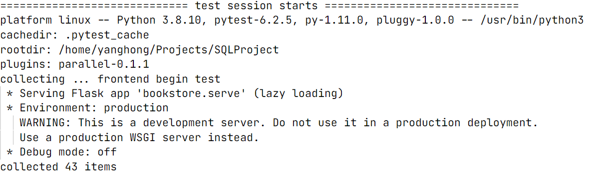
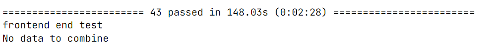
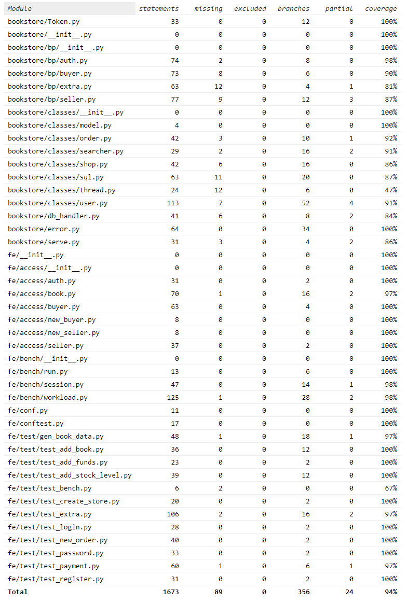

# Project 2 实验报告

**小组成员**：

| 姓名   | 学号        |  工作内容  |
| ------ | ----------- | --------- |
| 杨弘   | 10195501424 | 买家用户接口、商品查询、取消订单、历史查询、SQL事务与错误处理封装|
| 甄逸飞 | 10195501422 | 卖家用户接口、并发测试、超时自动取消订单、代码完善、ER图与数据库设计|
| 赵奕轲 | 10195501420 | 用户权限接口、postman测试、物流状态更新、数据库连接与配置、额外接口需求文档|

## 一、项目依赖与初始化

安装依赖

```
pip install -r requirements.txt
```

执行测试

```
bash script/test.sh
```

数据库使用PostgreSQL，需要在`bookstore/`目录下手动增添配置文件`database.ini`，文件内容如下：

```
[postgresql]
host=localhost
database=$database$
user=postgres
password=$password$
```

- host即为数据库的host，默认为localhost
- database为数据库的名称 ，使用前需要在PostgreSQL中创建
- user为用户名
- password为连接时所用密码

无需手动建表，连接数据库时会自动初始化（见`bookstore/db_handler.py`）。

项目使用Flask，执行`bookstore/serve.py`即可启动：

```
python bookstore/serve.py
```


## 二、数据库设计

### ER图


### 数据库组成

DDL语句见`bookstore/create_table.sql`，共创建五张关系表：


#### 用户类 Users

用于存储用户信息，包括用户名、密码、终端号、账户余额

表结构如下：


- uid：表的**主键**，用于唯一地识别每一个用户，即不能出现相同用户名的用户
- pwd：用户的密码，与用户名相对应，采用**非空约束**
- balance：账户余额，使用**浮点数类型**记录，采用**非空约束**
- terminal：终端号，标识用户登录的设备，用户未登录时为null，登陆时填入数据库


#### 店铺类 Shops

用于存储店铺信息，包括店铺id、店主id、商店评分

表结构如下：


- shop_id：表的**主键**，唯一地标识每一间店铺
- uid：用户id，标记了店铺的持有者（卖家），以外键的形式引用了users中的uid
- ranking：店铺评分，会影响一间店铺的排名


#### 订单类 Orders

用于存储订单信息，包括订单号、用户id、商店id、下单时间、订单状态

表结构如下：


- order_id：表的主键，用于区别不同的订单
- uid：记录买家的用户id，以外键的形式引用users中的uid
- shop_id：记录下单店铺的id，以外键的形式引用shops中的商店id
- order_time：下单时间
- current_state：订单状态，分为未支付、未发货、已发货、已送达（订单完成）、自动取消（超时未付）、买家主动取消


#### 订单内容类 Order_book

一张订单会包含多个书本，故新建一张关系表存放一对多关系。

表结构如下：


- order_id：绑定订单内容与订单号，以外键的形式引用orders中的订单id
- book_id：书本id，记录下单的书本对应的id
- order_quantity：订购数量，记录对应书本的下单数量

- 该表采用(order_id, book_id)的**复合主键**


#### 书本类 Books

每间店铺内可以存储多本书，新建关系表对应该一对多关系。

表结构如下：


- book_id：书本id
- shop_id：店铺id，记录上架该书本的店铺
- quantity：书本数量
- 其余属性对应书本的属性，可能存在空值的情况，故不进行非空约束
- 该表采用(book_id, shop_id)的**复合主键**


### 冗余信息的使用

本次实验中的优化主要以存储部分**冗余信息**的形式实现；除去主键约束以外未采用其他的索引构建。

- 记录店铺的关系表Shops中，以外键的形式存储了users.uid，将卖家与其店铺绑定；
- 记录订单的关系表Orders中，以外键的形式存储了shops.shop_id和users.uid，将每张订单与买家、下单商店绑定；
- 订单内容的关系表book_order中，以外键的形式存储了orders.order_id，绑定每张订单与订单内容，书本id同样是冗余信息，但未采用外键的形式存储；
- 记录店铺内部的商品的关系表books中，以外键的形式存储了店铺id与其所含有的书本id。

借助上述冗余信息，简化了SQL的查询过程，使得表与表之间的关系性更强。


## 三、接口实现

采用Flask的Blueprint组件，分模块实现了用户、买家、卖家三种接口。

前端页面路由等简单功能函数位于`bookstore/bp/`下，用于后端查询的函数与类定义位于`bookstore/classes/`下。

特别地，类的定义并不是按照用户、买家、卖家三类进行区分的，因为我们一致认为，**一位用户可以同时是买家与卖家**。故按照操作的对象进行区分，**将买家与卖家归入了用户类，又另外定义了商店类与订单类**。除此外，还定义了其他一些功能类。

在每一个类中，提供了fetch方法，**能够一次性返回该类中所含的所有属性**，为其他功能代码的编写提供了较为便捷的接口。

### 事务与异常处理

本次项目中，对psycopg2提供的数据库接口再次进行了封装，规定一次事务从建立cursor开始，到调用commit方法结束，保证每一次操作都是原子的。（具体实现见`bookstore/classes/sql.py`）

同时，添加了错误处理部分，将SQL语句执行过程中出现的问题作为异常抛出，保证项目启动后，不会因为异常发生而中止，而是以返回错误信息和错误码的形式提醒用户。

故，每一次对数据库的CRUD操作都能保证其**原子性**，且能够**抛出异常**而不中止程序的运行。

在`bookstore/error.py`中，对错误码与返回信息也进行了封装。只需调用内部的类定义，即可实现返回json格式错误码与信息的效果。


### Token的生成与处理

与token相关的函数单独定义在`bookstore/Token.py`中。

**加密**：采用了获取当前时间、用户名、密码、终端号，以上述变量为依据一齐加密生成

**解密**：需要判断token是否依然生效时，首先对token进行解密，判断当前时间与token生成时间之间的差距是否超出有效周期，判断是否仍属于同一用户、来自同一终端。

我们认为token应当是缓存在服务端的，而非存储在用户的数据库中，故没有将其作为Users表的一类属性。


### 用户权限 auth

用户权限接口的函数较简单，具体代码见`bookstore/bp/auth.py`和`bookstore/classes/user.py`.

#### 用户注册

**代码逻辑**：

采用Flask中的request组件获取参数，在try语句部分调用User类的create()函数创建新用户，使用except语句捕获该函数返回的错误信息并返回指定格式的错误信息。**create函数封装了预先查询，在向数据库插入新的用户数据之前，会判断是否已有同样用户**，若有，则直接返回error类中已定义的错误信息与错误码，没有则成功执行。


#### 用户注销

**代码逻辑**：

采用Flask中的request组件获取参数，在try语句内部实例化User类，调用其中的unregister()函数，except语句部分会捕获该函数内部返回的错误信息。**User类的初始化过程中，封装了一次查询数据库的过程，判断传入的用户名是否存在**，没有则直接返回错误信息。unregister()函数中，**根据用户名与密码删除数据库中的条目，并判断成功执行的语句数量**：若为0，则说明密码有误，返回错误信息；为1则顺利执行。


#### 用户登录

**代码逻辑**：

采用Flask中的request组件获取参数，在try语句内部实例化User类，调用其中的login()函数，except语句部分会捕获该函数内部返回的错误信息。**login()函数会根据用户名与密码修改数据库中的条目，将传入的终端号存入该条目的terminal中，并判断成功修改的条目数量**：若为0，则说明密码有误，返回错误信息；为1则顺利登录。

同时，调用token的加密方法，生成token。


#### 修改密码

**代码逻辑**：

采用Flask中的request组件获取参数，在try语句内部实例化User类，调用其中的password函数，except语句部分会捕获该函数内部返回的错误信息。**password函数接收用户名与新旧密码，以用户名和旧密码为依据，修改符合条件的条目，将password置为新密码，并判断成功修改的条目数量**：若为0，则说明密码有误，返回错误信息；为1则顺利登录。


#### 退出登录

**代码逻辑**：

采用Flask中的request组件获取参数，**首先进行token的有效性判断，失效则直接返回错误信息**；否则，在try语句内部实例化User类，调用其中的logout函数，except语句部分会捕获该函数内部返回的错误信息。**logout函数不需要任何参数，因为实例化User类的过程中已经保证了user_id存在性，故只是将terminal号重新置为空，表示该用户已退出登录**。


### 买家用户 buyer

#### 买家下单

##### 代码逻辑：

采用Flask中的request组件获取参数，**首先进行token的有效性判断，失效则直接返回错误信息**；否则，在try语句内部实例化User类(**在调用类构造函数时即检验用户id是否存在**)，调用其中的new_order()函数，在该函数传参中实例化Shop类(**在调用类构造函数时即检验商铺id是否存在**)。

该函数先按照订单中各书籍购买的数量，将相应商铺书籍库存减去该数量，一旦有一种书籍的库存不足则**整个修改操作回滚至最初修改库存之前的状态**，并报错退出。

之后，使用uuid生成唯一订单id，调用order类的create()函数，将订单id以及对应商铺id记录添加到**订单表**，并将订id及对应书籍id和购买数量记录插入到**订单-书籍表**中


#### 买家付款

##### 代码逻辑：

采用Flask中的request组件获取参数，为确保安全性首先在try语句内部实例化User类(**在调用类构造函数时即检验用户id是否存在**)，进行密码而非token的验证，失败则直接返回错误信息；否则调用该User类的payment()函数，在该函数传参中实例化Order类(**在调用类构造函数时即检验订单id是否存在**)，将用户余额减去订单的总金额，不足则直接返回错误信息，否则调用Order类的pay()函数将订单表中该订单号记录对应的状态值**从未支付更改为已支付未发货的状态**。


#### 买家充值

##### 代码逻辑：

采用Flask中的request组件获取参数，为确保安全性首先在try语句内部实例化User类(**在调用类构造函数时即检验用户id是否存在**)，进行密码而非token的验证，失败则直接返回错误信息；否则调用该User类的add_funds()函数，将用户表中该用户记录对应的余额加上充值金额。


### 卖家用户 seller

#### 创建商铺

##### 代码逻辑：

采用Flask中的request组件获取参数，首先进行token的有效性判断，失效则直接返回错误信息；否则，在try语句内部调用Shop类中的create()函数，在数据库的商铺表中插入一条新的记录，如果商铺表中已有重名商铺则返回错误信息。


#### 商家添加书籍信息

##### 代码逻辑：

采用Flask中的request组件获取参数，首先进行token的有效性判断，失效则直接返回错误信息；否则，在try语句内部实例化Shop类(**在调用类构造函数时即检验商铺id是否存在**)，调用其中的add_book()函数，在数据库的书籍表中插入一条新的记录，如果书籍表中复合主键(book_id,shop_id)存在重复则返回错误信息。


#### 商家添加书籍库存

##### 代码逻辑：

采用Flask中的request组件获取参数，首先进行token的有效性判断，其次判断添加库存值是否为正，若不通过则直接返回错误信息；否则，在try语句内部实例化Shop类(**在调用类构造函数时即检验商铺id是否存在**)，调用其中的add_stock_level()函数，修改书籍表中对应(商铺id-书籍id)的记录中库存的数值，如果书籍表中存在重复书籍id则返回错误信息“图书ID已存在”。


### 其他功能 extra

除去上述基础接口以外，其余接口的具体信息请见[`doc/extra.md`](doc/extra.md)。

#### 取消订单

我们将取消订单分为两种情况：

- 用户提交订单超时未付款，将自动取消订单。
- 用户在订单已付款未发货的状态下，可以手动取消订单。

##### 对于自动取消订单：

每当调用order类的create()函数生成一个新订单时，我们为其分配一个线程，在睡眠特定时间后将在数据库订单表中检查一次特定order_id的状态是否为未支付。是则将状态改为自动取消，并将订单中的各类书分别按购买数量加回到原商店对应书籍的库存中。

##### 对于手动取消订单：

采用Flask中的request组件获取参数，为确保安全性首先在try语句内部实例化User类(**在调用类构造函数时即检验用户id是否存在**)，进行密码而非token的验证，失败则直接返回错误信息；否则调用该User类的cancel()函数，在该函数传参中实例化Order类(**在调用类构造函数时即检验订单id是否存在**)。查询订单表判断该存在的订单是否属于当前用户，如果不存在则直接返回错误信息“订单不存在”；否则查看该订单的当前状态，如果处于未付款或已付款未发货的状态则修改状态至用户取消，否则取消操作失败。


#### 查询历史订单

##### 代码逻辑：

采用Flask中的request组件获取参数，**首先进行token的有效性判断，失效则直接返回错误信息**；否则，在try语句内部实例化User类(**在调用类构造函数时即检验用户id是否存在**)，调用该类的history()函数，在**订单表**中获取该用户的所有订单id及状态。


#### 物流状态

**代码逻辑**：

包括了卖家发货与买家收货两个接口，两者都是对订单状态的修改。但是，**我们认为确认收货需要较高等级的授权（如淘宝），故要求买家在确认收货、卖家在确认发货时，输入密码作为审核信息，判断该用户是否有权限执行相应操作**。

上述身份验证都是分别在对应User类中的receipt()函数及delivery()函数的开头执行的，一旦通过验证将进行相应订单的状态修改操作。修改订单信息时，同样对订单的状态作了判断：**卖家只能发送当前状态为“未发货”的订单，买家只能确认那些状态为“已发货”的订单**，若提供的订单号不满足该条件，则同样返回错误信息。


#### 检索图书

提供了对标题、标签、内容区域的检索。

**代码逻辑：**

对于每个区域的检索项，使用嵌套的list表示逻辑关系。在同一个子列表中的项，使用与的关系；对于不同的子列表，使用或的关系；对于不同的区域，使用与的关系。

例如对于以下的查询：

```json
{
	"titile": [["唐诗", "鉴赏"]],
    "content": [["唐诗"], ["宋词"]]
}
```

实际的查询是

```sql
(title LIKE "%唐诗%" AND title LIKE "%鉴赏%") OR 
(content LIKE "%唐诗%" OR CONTENT LIKE "%宋词%")
```

再根据需要的页数，返回对应区间的查询结果，实现分页功能。


## 四、测试表现

[测试结果](./result.txt)





[覆盖率](./htmlcov/index.html)


